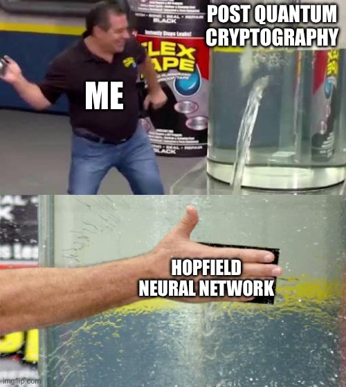

# Research Abstract: TRIP (Trigonometric-Hopfield Integrated Primes) for Post-Quantum Cryptography Problem Context

Traditional cryptosystems based on large primes (e.g., RSA) face obsolescence due to quantum factoring algorithms (Shor’s algorithm). Current NIST PQC finalists focus on lattice, code, and hash-based schemes, which rely on structured mathematical problems.

## TRIP Proposal
TRIP introduces a hybrid cryptographic framework that blends classical prime factorization hardness with nonlinear transformations and neural-network conditioning:

1. Core Hardness: Utilizes a set of large primes as trapdoor keys, expanding beyond the typical two-prime RSA model.

2. Nonlinear Conditioning: Applies a deterministic, secret mapping via a Hopfield network’s attractor space combined with trigonometric transformations, producing a highly entropic and non-algebraic public key representation.

3. Hybrid Security: The scheme’s security relies not only on factoring difficulty but also on the infeasibility of reversing the nonlinear neural mapping without knowledge of secret seeds.

## Advantages & Competitive Edge
1. Multi-assumption security: Even if factoring becomes tractable on quantum devices, reconstructing the nonlinear, high-dimensional Hopfield mapping remains computationally prohibitive.

2. Entropy amplification: The neural net layer acts as an entropy mixer, thwarting partial key leakage and adaptive attacks.

3. Reduced algebraic structure: Unlike lattice or code-based schemes, TRIP’s nonlinear design lacks clean algebraic properties exploitable by known PQC attacks.

4. Composable Hardener: TRIP can wrap existing PQC algorithms, adding an additional nonlinear conditioning layer to enhance security robustness.

## Open Challenges
Formal proofs linking Hopfield-based obfuscation to cryptographic hardness need development.

Performance benchmarks and optimization for practical deployment are outstanding research areas.

Quantum resilience of the combined nonlinear mappings requires rigorous analysis.

## Notes
* I conceptualized this idea after one cup of coffee immediately upon waking up. 
* I am not a professional. I'm just an out of work software engineer who enjoys thinking about solutions to hard problems.
* Decided to try a simplified approach.