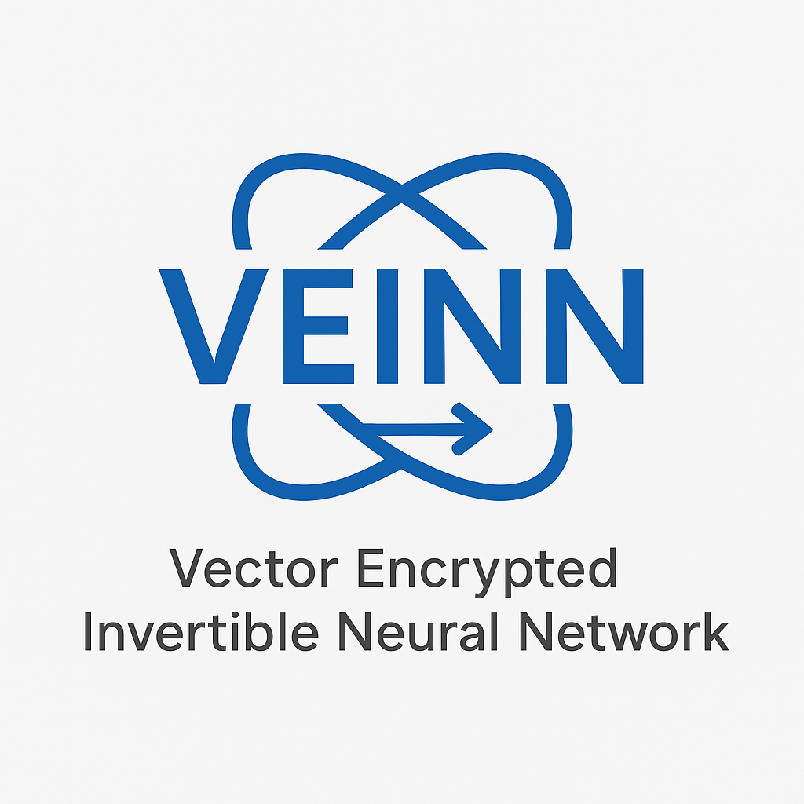

# VEINN – Vector Encrypted Invertible Neural Network

## Overview
**VEINN** is an experimental **post-quantum symmetric encryption** framework that transforms plaintext into **continuous high-dimensional vectors** and applies **key-derived, nonlinear, invertible transformations** using affine coupling layers.  
Deterministic noise is injected at each layer, creating a **polymorphic** encryption process that is tunable for complexity, scalability, and security research.

> ⚠ **Disclaimer:** VEINN is an experimental research framework.  
> It has not undergone formal cryptographic analysis.  
> Do **not** use in production systems.

---

## Key Features
- **Continuous Vector Space Encryption** – Plaintext is vectorized into the range `[-1, 1]`, avoiding purely discrete-space transformations.
- **Invertible Neural Network (INN) Layers** – Uses affine coupling layers for reversible, nonlinear transformations.
- **Layer-Level Deterministic Noise** – Adds key-derived, reproducible noise at each stage for complexity without losing reversibility.
- **Polymorphism** – Structure and parameters can change per key or per session.
- **Tunable Scalability** – Adjust vector dimensions, number of layers, and noise parameters for security and performance trade-offs.
- **Simple File-Based Persistence** – Save/load encrypted vectors and associated keys for testing and analysis.
- **Benchmark & Test Tools** – Measure reconstruction accuracy, speed, and transformation complexity.

---

## Motivation
Post-quantum cryptography (PQC) often focuses on **lattice-based** or **code-based** schemes in **discrete spaces**.  
VEINN explores an alternative: **embedding messages in continuous vector spaces** and transforming them with **key-dependent nonlinear mappings**.  
This creates a novel hardness layer that scales with:
- Vector dimension
- Number of INN layers
- Noise characteristics

---

## How It Works
### 1. Vectorization
- Convert UTF-8 plaintext to Base64
- Map bytes to floats in `[-1, 1]`
- Pad to an even dimension if needed

### 2. Layered Encryption
For each INN layer:
1. **Key-derived parameters** (`scale`, `shift`) generated via SHA-256.
2. **Affine coupling transformation** applied to half the vector.
3. **Deterministic noise** injected (same noise is removed during decryption).

### 3. Decryption
- Reverse the process, removing noise and applying inverse affine couplings in reverse order.

---

## Example Usage
### Encrypt & Save

    python3 cli/veinn.py  

1. Select **Encrypt & save**  
2. Enter your message  
3. Choose number of layers (default: 10)  
4. Provide filename to store encrypted vector  
5. Copy the hex key shown – this is required for decryption  

### Load & Decrypt
    
    python3 cli/veinn.py  

1. Select **Load & decrypt**  
2. Provide encrypted vector filename  
3. Enter number of layers used during encryption  
4. View reconstructed plaintext  

---

## Research Notes
- **Symmetric by design** – immune to Shor’s algorithm in the same way as AES (given sufficient key size).
- **Polymorphism** – structure and transformations change per session or per key.
- **Scalable hardness** – increase layers, vector dimension, and noise level to increase complexity.
- **Hybrid potential** – could be combined with lattice-based PQC (e.g., Kyber) to protect the VEINN key.

---

## Contributing
Cryptographers, security researchers, and ML specialists are invited to:
- Explore alternative invertible layers
- Suggest new noise injection methods
- Analyze attack surfaces
- Provide formal security proofs

---

## License
[MIT License](https://opensource.org/license/mit)  