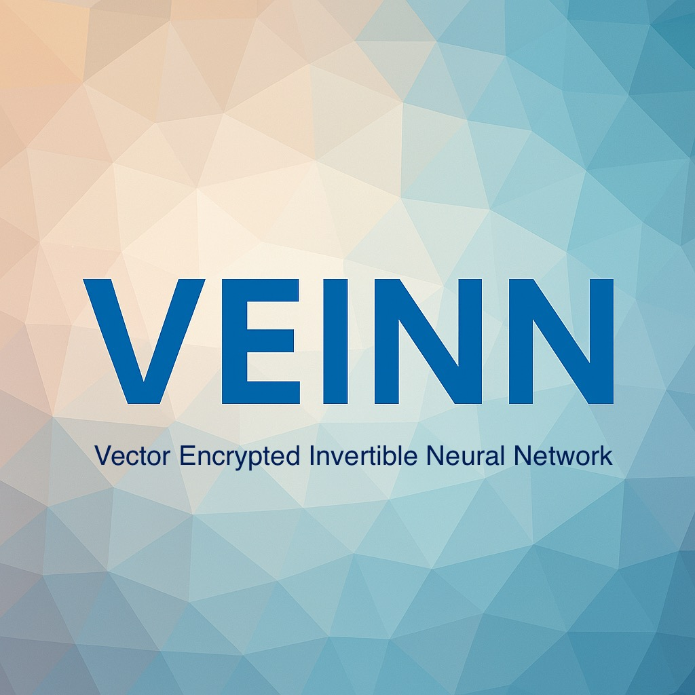

# VEINN: Hybrid Non-linear Invertible Neural Network Encryption

**VEINN (v3 Hybrid)** is a cryptographic tool that combines a non-linear Invertible Neural Network (INN) with ChaCha20-Poly1305 for secure seed encryption and HMAC-SHA256 for ciphertext authentication. It supports RSA hybrid encryption, Paillier homomorphic operations, and an encrypted keystore for key management. The system is designed for both text and numeric data, with a focus on invertibility for reversible transformations and non-linearity to resist linear cryptanalysis.

## Features

- **Non-linear INN Encryption**: Encrypts data using an invertible neural network with multiplicative scalars and permutations in a 256-bit prime field, aiming for IND-CPA security.
- **ChaCha20-Poly1305**: Secures the INN seed in RSA hybrid mode with IND-CCA2 security.
- **HMAC-SHA256**: Authenticates ciphertext, metadata, nonce, and timestamp.
- **RSA Hybrid Encryption**: Securely exchanges INN seeds using RSA with ChaCha20-Poly1305.
- **Paillier Homomorphic Encryption**: Supports homomorphic addition on encrypted numbers.
- **Encrypted Keystore**: Stores RSA private keys, Paillier keys, and INN seeds securely.
- **Modes**: Supports text (PKCS7-padded) and numeric (block-based) encryption.
- **Nonce and Timestamp**: Ensures uniqueness and replay protection.
- **CLI Interface**: Interactive and batch modes for all operations.

## Installation

### Prerequisites
- Python 3.8+
- Required libraries:
  ```bash
  pip install cryptography phe numpy
  ```

### Setup
1. Clone the repository:
   ```bash
   git clone https://github.com/CaelumSculptoris/veinn.git
   cd veinn
   ```
2. Install dependencies:
   ```bash
   pip install -r requirements.txt
   ```
3. Ensure `veinn.py` is executable:
   ```bash
   chmod +x veinn.py
   ```

## Usage

### Interactive Mode
Run the script to access the CLI menu:
```bash
./veinn.py
```
Options:
1. Create encrypted keystore
2. Generate RSA keypair
3. Generate Paillier keypair
4. Encrypt with RSA public key (RSA + INN + ChaCha20-Poly1305)
5. Decrypt with RSA private key
6. Encrypt with public INN (seed-based)
7. Decrypt with public INN
8. Paillier encrypt numbers
9. Paillier decrypt numbers
10. Homomorphic addition (Paillier)
0. Exit

### Batch Mode Examples

#### Create Keystore
```bash
./veinn.py create_keystore --passphrase "mysecret" --keystore_file keystore.json
```

#### Generate RSA Keypair
```bash
./veinn.py generate_rsa --bits 2048 --pubfile rsa_pub.json --privfile rsa_priv.json
```
With keystore:
```bash
./veinn.py generate_rsa --bits 2048 --pubfile rsa_pub.json --keystore keystore.json --passphrase "mysecret" --key_name rsa_key
```

#### Encrypt with RSA Public Key
Text mode:
```bash
./veinn.py rsa_encrypt --pubfile rsa_pub.json --message "Hello, World!" --mode text --out_file enc.bin --binary
```
Numeric mode:
```bash
./veinn.py rsa_encrypt --pubfile rsa_pub.json --numbers 42 123 999 --mode numeric --bytes_per_number 4 --out_file enc.json
```

#### Decrypt with RSA Private Key
```bash
./veinn.py rsa_decrypt --privfile rsa_priv.json --enc_file enc.bin
```
With keystore:
```bash
./veinn.py rsa_decrypt --keystore keystore.json --passphrase "mysecret" --key_name rsa_key --enc_file enc.json
```

#### Public INN Encryption
```bash
./veinn.py public_encrypt --seed "myseed" --message "Secret message" --mode text --out_file enc_pub.json
```

#### Paillier Encryption
```bash
./veinn.py paillier_encrypt --pubfile paillier_pub.bin --numbers 10 20 30 --out_file paillier_enc.bin --binary
```

#### Homomorphic Addition
```bash
./veinn.py hom_add --file1 paillier_enc1.bin --file2 paillier_enc2.bin --paillier_pubfile paillier_pub.bin --out_file hom_add.bin --binary
```

### File Formats
- **JSON**: Human-readable output (default).
- **Binary**: Compact storage using pickle (use `--binary`).

## Security Considerations
- **Non-linear INN**: Aims for IND-CPA security with non-linear transformations (multiplicative scalars, permutations) in a 256-bit prime field. Lacks formal cryptanalysis; use with caution in production.
- **ChaCha20-Poly1305**: Provides IND-CCA2 security for seed encryption in RSA hybrid mode.
- **HMAC-SHA256**: Ensures ciphertext and metadata integrity but does not provide IND-CCA2 for data encryption.
- **Nonce Management**: Uses 16-byte nonces for INN and 12-byte nonces for ChaCha20-Poly1305, with timestamp validation to prevent reuse.
- **Key Storage**: Use the encrypted keystore for secure key management. Protect the passphrase.
- **Paillier**: Secure for homomorphic addition but requires careful key management.

**Warning**: The INN is a custom construction and not formally vetted. For production systems, consider standard ciphers (e.g., ChaCha20-Poly1305 alone) unless invertibility or homomorphic properties are required.

## Technical Details
- **Non-linear INN**:
  - Block size: 16 bytes (configurable, must be even).
  - Layers: 8 (configurable).
  - Prime field: 256-bit prime.
  - Operations: Matrix multiplications, multiplicative scalars, and permutations derived via HKDF.
- **Key Derivation**: HKDF-SHA256 derives separate keys for INN encryption, HMAC authentication, and ChaCha20-Poly1305 seed encryption.
- **Invertibility**: The INN ensures reversible transformations for both text and numeric modes.
- **Dependencies**: `cryptography`, `phe`, `numpy`.

## Contributing
Contributions are welcome! Please submit pull requests or open issues for:
- Performance optimizations (e.g., Cython for INN).
- Additional homomorphic schemes (e.g., BFV, CKKS).
- Formal cryptanalysis of the INN.
- Bug fixes or feature enhancements.

## License
MIT License. See [LICENSE](LICENSE) for details.

## Notes
- In Progress
   - veinn-ckks.py (Leveraging CKKS homomorphism)
   - veinn-hmac.py (non-linear INN + ChaCha20-Poly1305 + HMAC)
   - veinn-lwe.py (Lattice based INN) <-- Currently my ideal approach, but unstable
   - veinn-rsa.py (RSA, OAEP, HMAC, PBKDF2)
   - veinn.py (Stable)
